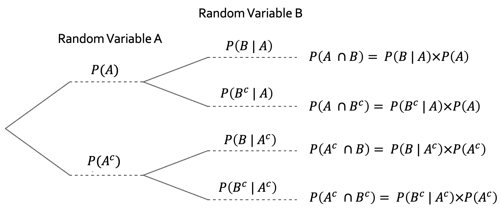

```{r setup, include=FALSE}
knitr::opts_chunk$set(echo = FALSE)

```

## Probability and Statistics

```{r, out.width='50%', fig.align='center'}

```

- Statistics: Given data collected in a sample, what can we say about the target population?
- Probability: Given a target population, what is the chance of observing specific outcomes if you were to select a random sample?


## Probability and Statistics

- Probability is what allows us to determine if an observed event is expected or extreme
- A piece of data might seem rather extreme but upon further review is actually quite in line with expectation
- We interpret data by considering the probability that competing models of the “truth” would produce the observed data


## Set theory -  Definitions

**Sample space** - set of all possible outcomes from an experiment.

**Event** - Any set of outcomes from the sample space


## Set theory - Example

Example: 3 patients are in a clinical trial. We are interested in if their disease goes into remission or continues. The outcome is either remission (R) or disease (D). What is the sample space for the outcomes of the 3 people in this trial? \pause

(RRR, RRD, RDR, RDD, DRR, DRD, DDR, DDD)

## Unions, Intersections, and Complements! Oh my!

Union: $A \cup B$ is when either $A$ OR $B$ occur. 

Intersection: $A \cap B$ is when both $A$ AND $B$ occur. 

Complement: $A^C$ or $A'$ is when $A$ does not occur. 

## Unions, Intersections, and Complements - Example

$A$ - systolic blood pressure (SBP) is less than or equal to 129 

$B$ - diastolic blood pressure (DBP) is less than or equal to 80. 

$A \cap B$ occurs for people with normal blood pressure. $A^C \cup B^C$ occurs for people with high blood pressure. 

What are the definitions for normal blood pressure and high blood pressure in words? \pause

Normal blood pressure is SBP less than or equal to 129 and DBP less than or equal to 80. 

High blood pressure is SBP greater than 129 or DBP greater than 80.

## Fun with compliments!

\pause 

You look nice today!

You are a real trooper for being in class right now!

You must be super smart to part of BSDI 2019!

## Fun with complements (and unions and intersections)!

$P(A \cup B) = P(A) + P(B) - P(A \cap B)$

The probability of $A$ or $B$ is the the probability of $A$ plus the probability of $B$. However, events that count as $A$ and $B$ ($A \cap B$) are counted twice here (once when we count $A$ and once when we count $B$), so we must subtract $P(A \cap B)$ since that has already been counted.

$P(A^C) + P(A) = 1$ 

An event either occurs or does not occur. Since there are no other options, then these values must sum to 1 since there is 100% probability of either event occurring. 

$P(A^C \cap B ) + P(A \cap B) = P(B)$

$B$ can also be divided into events that are $A \cap B$ and $A^C \cap B$. Events that are in $B$ are either also $A$ or $A^C$ so the sum of these two probabilities must be $P(B)$.


## Permutations and combinations

- Permutation: The number of ways events can be arranged/ordered
- Combination: The number of ways events can be selected (ordering does not matter) 


## Permutation and Combination Examples

 \begin{columns}
          \column{0.35\linewidth}
             \centering
```{r, out.width='100%', fig.align='center'}
knitr::include_graphics('Bob\'s_Burgers_promo.png')
```
           \column{0.65\linewidth}
              - A family has 3 children: Tina, Gene, and Louise. Possible birth orders is an example of a permutation. \vspace{0.5in}

- 3 dice are rolled. The possible outcomes for the dice rolls is an example of a combination. 

         \end{columns} 

## Binomial coefficient 

- There are multiple ways to select items.
- Ordered - the order of selection matters (1st, 2nd, 3rd, etc)
- With replacement - The items can be selected multiple times


$$ {n \choose r} = \frac{n!}{r!(n-r)!} $$

This is the number of possible outcomes when selecting $r$ elements from $n$ total elements when order does not matter and selection is happening without replacement. Called "$n$ choose $r$."

## 4 ways of counting and examples

Ordered without replacement - Results of a race

Ordered with replacement - Phone numbers

Unordered without replacement - Selecting team members for a group project

Unordered with replacement - States from which a group of people are from

## Number of possible arrangements of size $r$ from $n$ objects

\begin{tabular}{ c c  c } \hline
 & Without replacement & With replacement \\ \hline
 Ordered & $\frac{n!}{(n-r)!}$ & $n^r$ \\
 Unordered & ${n \choose r}$ & ${n+r-1 \choose r}$ \\
\hline 
\end{tabular}

## Counting problems - Examples

A protein reads a short gene segment that is 20 base pairs long in sequence. There are 4 options for the base pairs (A, T, G, and C). What is the total number of sequences of base pairs for this short gene segment? \pause 

Ordered with replacement, $4^{20}$ \pause

20 people volunteer to be in a study, but there is only enough funding for 15 to participate. What is the number possible combinations of people in the study? \pause

Unordered without replacement . ${20 \choose 15} = 15504$

## Counting and probabilities

Counting is useful in probabilities. Questions that can be answered with counting:

What is the probability:

- at least 2 people share a birthday in a room full of people?
- of winning a poker hand with a pair of aces?
- a team of all women will occur when a class is randomly divided into teams of 5?

##  Approach to counting and probabilities

$$\frac{\text{Outcomes satisfying condition(s)}}{\text{Total number of outcome possibilities}}$$

Example: Birthday problem. Let $K$ be the event that at least two people share a birthday. $1-P(K)$ is the probability that no people share a birthday. Let's work with that.

Total number of possibilities: \pause total number of possible birthday combinations of the group. Number of ways to select $n$ from 365 options with repeats. \pause $365^n$

\pause Outcomes satisfying question: \pause number of birthday combinations where there are no overlaps. Number of ways to select $n$ from from 365 options with no repeats. \pause $\frac{365!}{(365-n)!}$

## Counting with R

```{r, echo=T}
factorial(6)

choose(6, 2)

(1-(factorial(365)/factorial(365-23))/(365^23))
```

## Trick to take logs when this happens

$$n! = \exp \left( \sum_{i=1}^n (\log(i)) \right) $$

```{r, echo=T}
1-exp(sum(log(1:365)) - sum(log(1:(365-23))) -23*log(365))
```

## Conditional probabilities

Conditional probability - The probability of some event given another event has occurred.

$P(A|B) = \frac{P(A \cap B)}{P(B)}$

This is reducing sample space to only include events where $B$ occurs.

## Tree Diagrams 

Tree diagrams can be useful tools for conditional probability

```{r, out.width='100%', fig.align='center'}

```

## Classic Monty Hall example: Pick a door!

Pretend you're on a game show and there are three doors. Behind one door is a car. Behind the two other doors are goats. You win the prize behind whatever door you pick. 

What is the probability that you pick the door with the car behind it? 

## Classic Monty Hall example: Should we switch doors?

Pretend you're on a game show and there are three doors. Behind one door is a car. Behind the two other doors are goats. You win the prize behind whatever door you pick. Let's say you pick door #1.

Now suppose the host opens one of the doors you didn't select, revealing a goat. The host asks if you'd like to switch doors. Do you switch doors or stick with your original door?

## Classic Monty Hall example: Tree diagram

```{r, out.width='100%', fig.align='center'}

```

## Classic Monty Hall example: Thinking through the problem

You have $\frac{1}{3}$ probability of winning the car with your current door. That means that there is a $\frac{2}{3}$ probability that the car is behind one of the other two doors. Since one of the doors has probability 0 of having the car (since it has been opened revealing the goat), that means the remaining other door has $\frac{2}{3}$ of having the car. Switch doors!


## Bayes Theorem

Suppose you are given $P(B|A)$ but you're really more interested in $P(A|B)$. For example, you know the probability a patient has a positive result on a diagnostic test given that they have a disease. But what you really want to know is the probability that they have the disease given that they have a positive test. 

Enter: BAYES THEOREM!

$$P(A|B) = \frac{P(B|A)P(A)}{P(B)}$$

## Proof of Bayes Theorem

\begin{align*}
P(A|B) &= \frac{P(A \cap B)}{P(B)} & \text{Definition of conditional probability}\\
&= \frac{P(B|A)P(A)}{P(B)} & \text{Definition used slightly differently}
\end{align*}


## Independence
Two variables are independent if: 
$$ P(A \cap B) = P(A)P(B) $$

Variables $A$ and $B$ are independent if outcome of $A$ does not influence the outcome of $B$.


## How can we tell if events are independent?

- Design of the study (All subjects are unrelated.)
- Sometimes assumed (Patients treated at different clinics are independent.)
- Study may be interested in determining if events are independent (Is high blood pressure independent of sex?)


## Conditional probabilities if events are independent?

$A$ and $B$ are independent. What is $P(A|B)$? \pause

\begin{align*}
P(A|B) &= \frac{P(A \cap B)}{P(B)} & \text{By definition of conditional probabilities}\\
& = \frac{P(A)P(B)}{P(B)} & \text{By definition of independence}\\
& = P(A)
\end{align*}

## Sally Clark - The Trial

Sally Clark had two sons die of sudden infant death syndrome (1996 and then 1998). She was charged with murder. A pediatrician testified at the trial that the probability of one cot death in an affluent non-smoking family was 1 in 8,543 (lower than the national average) so the probability of two cot deaths in such a family was 1 in 73 million. Since there are 700,000 live births in Britain each year, a double cot death would be expected to occur once every hundred years. She was found guilty.

## Sally Clark - Statistical Misuse

Why might the 1 in 73 million number inaccurate?

## Sally Clark - Statistical Misuse

+The deaths are not independent

   + Same parents 
  
   + Same circumstances
  
+The factors that make SIDS rare in the Clark family also make a double infant murder rare

+The 1 in 8,500 value failed to take into account factors that makes SIDS more likely (both babies were boys which makes SIDS more likely).

##  Sally Clark - Statistics

Let $A$ be one cot death event and $B$ be a second cot death event. Let $G$ be the event that Sally Clark is guilty of murder and $I$ be the event that Sally Clark is innocent.

Is it likely that $P(A \cap B) = P(A)P(B)$?

Is it likely that $P(G | A \cap B) > P(I | A \cap B)$?

$A$ and $B$ are both rare events, but that does not imply $G$. 

## Sally Clark - Aftermath

After a second appeal, Sally Clark's conviction was overturned. Many other cases were reviewed since the same pediatrician had presented similar evidence in other cases and 3 other women had their convictions overturned or were acquitted. 

## Diagnostic tests

Diagnostic tests are a way to detect if a person has a disease. These tests have different features. Let $D+$ be having the disease, $D-$ be not having the disease, $T+$ be having a positive test, and $T-$ be having a negative test. 

Positive predictive value - the probability of having the disease given that you received a positive test. $P(D+|T+)$

Negative predictive value - The probability you do not have the disease given that you had a negative test. $P(D-|T-)$

Sensitivity - The probability of having a positive test given that you have the disease. $P(T+|D+)$

Specificity - The probability of having a negative test given that you do not have the disease. $P(T-|D-)$

## Diagnostic test - Examples

\begin{tabular}{|c|cc|c|} \hline
& Disease + & Disease - & Total \\ \hline
Test + & $A$ & $B$ & $A+B$ \\
Test - & $C$ & $D$ & $C+D$ \\ \hline
& $A+C$ & $B+D$ & $A+B+C+D$ \\ \hline
\end{tabular}

\pause 

PPV = \pause $A/(A+B)$ 

NPV = \pause $D/(C+D)$

Sensitivity = \pause $A/(A+C)$ 

Specificity = \pause $D/(D+B)$

## Random variables

- Random variables are functions that map events in a sample space to the real numbers. 

- Typically written $X$, $Y$, $Z$, etc.

- RVs can be continuous or discrete. 

## Examples of RVs

- Tossing a coin: Head then $X$ = 1, Tails then X = 0
- Traffic: $X$ = Number of cars going through a toll per hour
- Rolling 2 dice: $X$ = sum of numbers on dice
- Biomarkers: $X$ = amount of biomarker in a blood sample

## Probability functions

The probability function for a random variable gives the probability of outcomes for that RV. 

If the RV is continuous it is called a probability mass function (pmf).

If the RV is discrete it is called a probability density function (pdf).

## PMFs/PDFs

Properties of pmfs/pdf:

1) $f_X (x) \ge 0$ for all $x$
2) $\sum_x f_X(x) = 1$ for pmfs OR $\int_{-\infty}^{\infty} f_X(x) dx = 1$ for pdfs

## Probability function examples

Show that the following is a pmf (geometric distribution): $$P(X=x) = (1-p)^{x-1}p, \text{ for } x = 1, 2, \cdots$$

Show that the following is a pdf (exponential distribution): 
$$f_X(x|\beta) = \frac{1}{\beta}e^{-x/\beta}, \text{ for } 0\le x < \infty$$


## Probability function examples - Geometric

Show that $P(X=x) = (1-p)^{x-1}p$ for $x = 1, 2, \cdots$ is a pmf.
\pause
\begin{align*}
\sum_{x = 1}^\infty (1-p)^{x-1}p &= p \sum_{x = 1}^\infty (1-p)^{x-1}\\
\onslide<2->{&=  p \sum_{x = 0}^\infty (1-p)^{x} \\}
\onslide<3->{&= p \frac{1}{p} \\} 
\onslide<4->{&= 1}
\end{align*}

## Probability function examples - Exponential

Show that $f_X(x|\beta) = \frac{1}{\beta}e^{-x/\beta}$ is a pdf

\pause
\begin{align*}
\int_0^\infty \frac{1}{\beta} e^{-x/\beta} dx &= \frac{1}{\beta}\int_0^\infty e^{-x/\beta} dx \\
\onslide<2->{&=  \frac{1}{\beta} (-\beta) e^{-x/\beta} \mid_0^\infty \\}
\onslide<3->{&= 0 - \frac{1}{\beta} (-\beta) \\} 
\onslide<4->{&= 0 +1 \\}
\onslide<4->{&= 1 }
\end{align*}


## Cumulative distribution functions

Cumulative distribution function (cdf) of a random variable is defined as $F_X(x) = P_X (X \le x)$ for all x. 

Properties:

1)  $\lim_{x \to - \infty} F(x) = 0$ and $\lim_{x \to \infty} F(x) = 1$
2)  $F(x)$ is a non-decreasing function of $x$
3)  $F(x)$ is right-continuous. That is, for every number $x_0$, $\lim_{x \downarrow x_0} F(x) = F(x_0)$

## Expected values and variance   

Expected value of a RV is essentially it's average value, or mean value.
Variance of a RV is a measure of the spread of it's distribution.

Continuous expected value: $$E(X) = \int_X xf(x)dx$$

Discrete expected value: $$E(X)= \sum_X x P(X = x) $$

Variance: $$Var(X) = E[(X - E(X))^2] = E(X^2) - (E(X))^2$$

## Expectation and variance example
```{r, message=FALSE}
suppressWarnings(library(ggplot2))
suppressWarnings(library(cowplot))
x <- seq(0, 1, length.out=100)
df <- data.frame(x = x, y = dbeta(x, 10, 10))
cent<-ggplot(df) + geom_line(data = df, aes(x = x, y = y)) + geom_vline(xintercept = 1/2, color="blue", size= 1.5)  + theme_bw()

df <- data.frame(x = x, y = dbeta(x, 2, 10))
right<-ggplot(df) + geom_line(data = df, aes(x = x, y = y)) + geom_vline(xintercept = 1/6, color="blue", size= 1.5)  + theme_bw()

df <- data.frame(x = x, y = dbeta(x, 10, 2))
left<-ggplot(df) + geom_line(data = df, aes(x = x, y = y)) + geom_vline(xintercept = 5/6, color="blue", size= 1.5)  + theme_bw()

df <- data.frame(x = x, y = dbeta(x, 2, 2))
vars<-ggplot(df) + geom_line(data = df, aes(x = x, y = y)) + geom_vline(xintercept = 1/2, color="blue", size= 1.5)  + theme_bw()

plot_grid(cent, right, vars, ncol=1)

```


## Binomial distribution


This distribution arises when there is some number of objects that are classified a success or a failure (or positive/negative, 1/0, etc.)

$$X \sim Bin(n, p) $$ 

$n$ is the number of objects, $p$ is the probability of success

$$P(X=x) = {n \choose x}p^x(1-p)^{n-x}$$

$$E(X) = np$$

$$Var(X) = np(1-p)$$

## Poisson distribution

This distribution is typically used for count data. 

$$X \sim Poisson(\lambda) $$ 
$\lambda$ is a measure of both the scale and location of this distribution.

$$P(X=x) = \frac{e^{-\lambda}\lambda^x}{x!}$$

$$E(X) = \lambda$$

$$Var(X) = \lambda$$

## Normal distribution

This distribution is most commonly assumed for continuous data that is not skewed

$$X \sim N(\mu, \sigma^2) $$ 

The standard normal distribution is $N(0, 1)$. 

The function for $F(X)$ when $X \sim N(0, 1)$ is written $\Phi(X)$

## Normal Distribution

$$f(x) = \frac{1}{\sqrt{2\pi \sigma^2}} e^{-(x-\mu)^2/(2\sigma^2)}$$

$\mu$ is the location parameter and $\sigma^2$ is the scale parameter


$$E(X) = \mu$$

$$Var(X) = \sigma^2$$


## Z-scores and p-values

Z-scores represent corresponding values on the standard normal distribution for a value on a non-standard normal distribution. For a value $X$ from a $N(\mu, \sigma^2)$ the z-score is:

$$Z = \frac{X - \mu}{\sigma} $$

P-values are the probability of observing a value $X$ or more extreme under the assumption that it comes from a normal distribution of mean $\mu$ and $\sigma^2$. 


## Calculation of p-values
Suppose $X= 2$ and we assume this value comes from a standard normal. Then the p-value is $2(1-\Phi(2))$. If this came from a non-standard then calculate the Z-score and it would be $2(1-\Phi(|Z)|))$. 

```{r, echo=T}
2*(1-pnorm(2))
```

## Visualization of p-values

```{r, message=FALSE}
suppressWarnings(library(ggplot2))
 ggplot(NULL, aes(c(-3,3))) +
  geom_area(stat = "function", fun = dnorm, fill = "#00998a", xlim = c(-3, -2)) +
  geom_area(stat = "function", fun = dnorm, fill = "grey80", xlim = c(-2, 2)) +
  geom_area(stat = "function", fun = dnorm, fill = "#00998a", xlim = c(2, 3)) +
  labs(x = "z", y = "") +
  scale_y_continuous(breaks = NULL) +
  scale_x_continuous(breaks = c(-2, 2)) 

```
